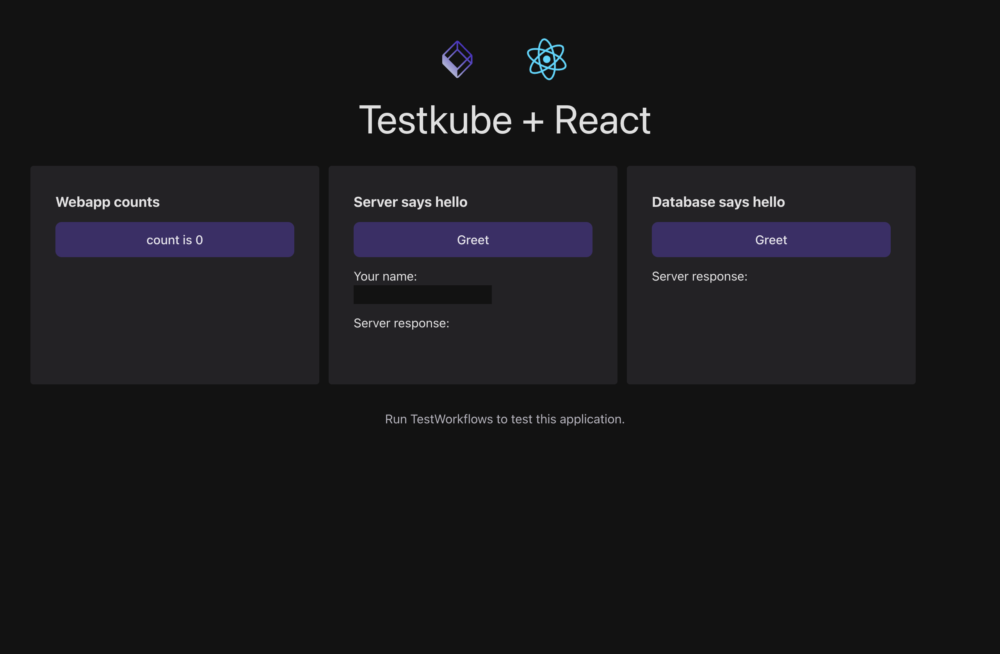

# Testkube Sample Application

A React frontend, NodeJs backend and a PostgreSQL database.


## Running the application locally

1. Bring application stack up with [Docker Compose](https://docs.docker.com/compose/)
```
docker-compose up
```
2. Application frontend available at `http://localhost:4173/`

## Running tests

Unit tests can be executed without a running appliction:

```
npm run test
```

For E2E test, you should first run the application as described above:

```
npm run test:e2e
```
